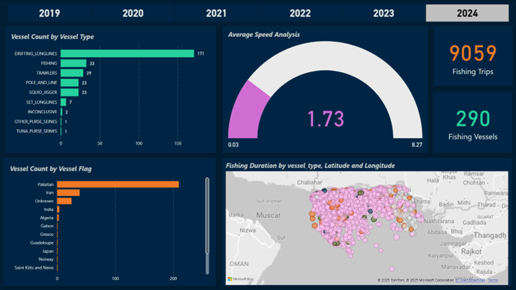

# 🛳️ Power BI Maritime Vessel Activity Dashboard

This project presents a comprehensive **Power BI dashboard** to analyze and visualize maritime vessel activity using real-world AIS (Automatic Identification System) data. The dashboard focuses on identifying trends and insights related to vessel types, flags, speeds, and fishing activity—providing valuable information for marine researchers, analysts, and maritime authorities.

---

## Project Components

### 1. Interactive Dashboard (Main Feature)
A fully interactive dashboard designed in Power BI Desktop, featuring:

- Total number of unique fishing vessels
- Count of fishing trips
- Average vessel speed analysis (with donut gauge)
- Vessel count breakdown by type (e.g., trawlers, longliners, etc.)
- Vessel count by flag (e.g., Pakistan)
- Geospatial map plotting fishing activity using latitude and longitude

### 2. Query View using DAX
Implemented DAX queries in Power BI's Query View for in-depth data exploration and slicing, including:

- Previewing the top 10 rows of the dataset
- Calculating the total number of unique vessels
- Summarizing vessel counts grouped by vessel type
- Aggregating monthly active vessel counts by year and month
- Identifying the top 5 vessel flags with the most records
- Analyzing vessel counts year-over-year along with calculating YoY growth rates

---

## 💡 Highlights

- Created from raw AIS maritime data
- Simple, clean and dark-themed UI as per user requirements for professional insight presentation
- Combines dashboard visualizations with analytical DAX queries
- Supports exploratory analysis and quick filtering

---

## 🧠 Key Skills Demonstrated

- Power BI (Dashboard & Query View)
- DAX (Data Analysis Expressions)
- Geospatial Mapping (using latitude/longitude)
- Maritime Data Analysis
- Time Series Aggregation
- Interactive Visualization Design

---

